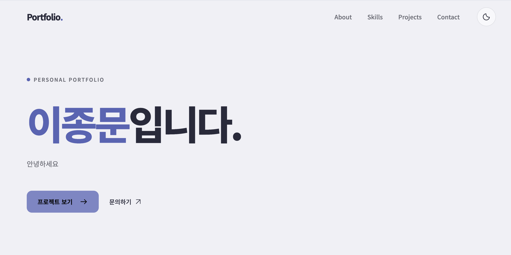
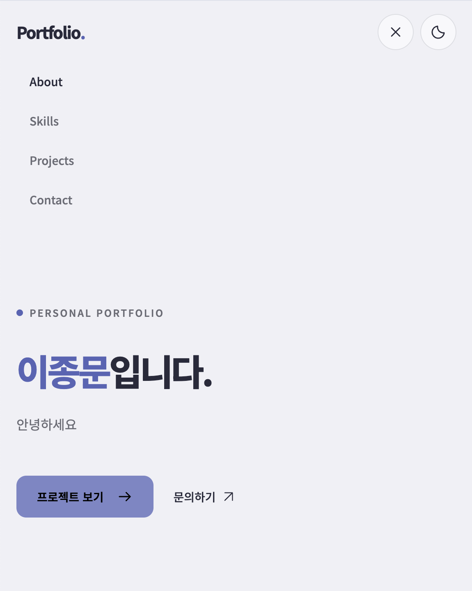
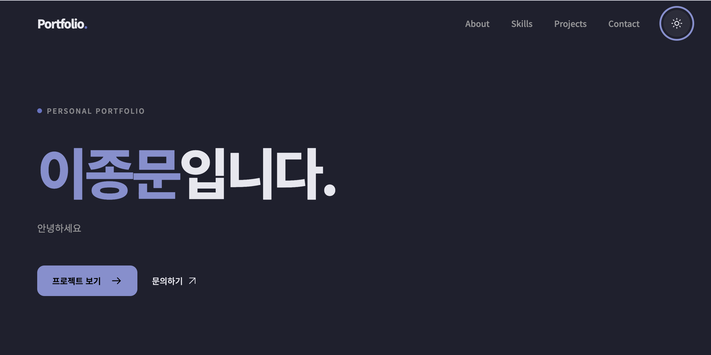

# B1-1

HTML, CSS, JavaScript 기반 반응형 개인 포트폴리오

## 배포 주소

https://cdlwhdans.github.io/B1-1/

## 사용 기술

- 언어: HTML, CSS, JavaScript
- API: GitHub REST API
- 폰트: Noto Sans KR
- 아이콘: SVG

## 실행 방법

저장소 클론 → VS Code에서 폴더 열기 → Live Server로 index.html 실행

## 주요 기능

- 페이지 구성: Hero, About, Skills, Projects, Contact, Footer
- 반응형: 모바일 기본, 768px / 1024px 브레이크포인트
- 모바일 메뉴: 열기 / 닫기, 메뉴 선택 시 닫기
- 다크 모드: 테마 전환, localStorage에 설정 저장
- 프로젝트: GitHub 저장소 조회 및 카드 표시
- API 상태: 로딩 / 성공 / 오류 / 빈 목록, 오류 시 재시도
- 스크롤: 부드러운 섹션 이동, 등장 애니메이션, 맨 위로 버튼
- 문의 폼: 필수값 / 이메일 형식 검사, 오류 / 성공 메시지
- 실제 메시지 전송: 미구현

## 스크롤 기준

- 헤더 배경 변경: 60px 이상
- 맨 위로 버튼 표시: 300px 이상
- 섹션 애니메이션: 화면 중앙에 위치한 섹션에 적용
- 구현 방식: IntersectionObserver 대신 scroll 이벤트 사용
- threshold: 미사용
- 변경 이유: 여러 섹션의 동시 애니메이션을 줄이고 중심 섹션 강조
- 동작 줄이기 설정: 애니메이션 / 부드러운 스크롤 비활성화

## 화면

### 데스크톱

### 모바일

### 다크 모드

